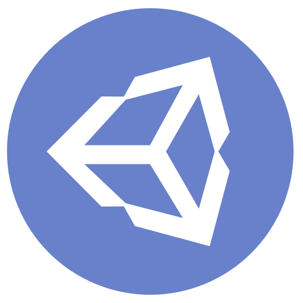

  

<h1 align="center">Hello there, I'm Felipe !</h1>

  

- 🌱 I’m currently learning Unreal Engine 5! Also making a game...

- 🤖 I like generating images with Stable Diffusion!

- 🤺 Learning how to model in Blender 3D.

- 🎮 If i were a genius inventor, i would most like to invent the BEST game ever.

 
<h1 align="left">Languages and tools i'm learning!</h1>

   

  
<h1 align="left">My activity</h1>

|  |  |
| ------------- | ------------- |

|  | 
| ------------- | 

<h1 align="left">Find me</h1>

